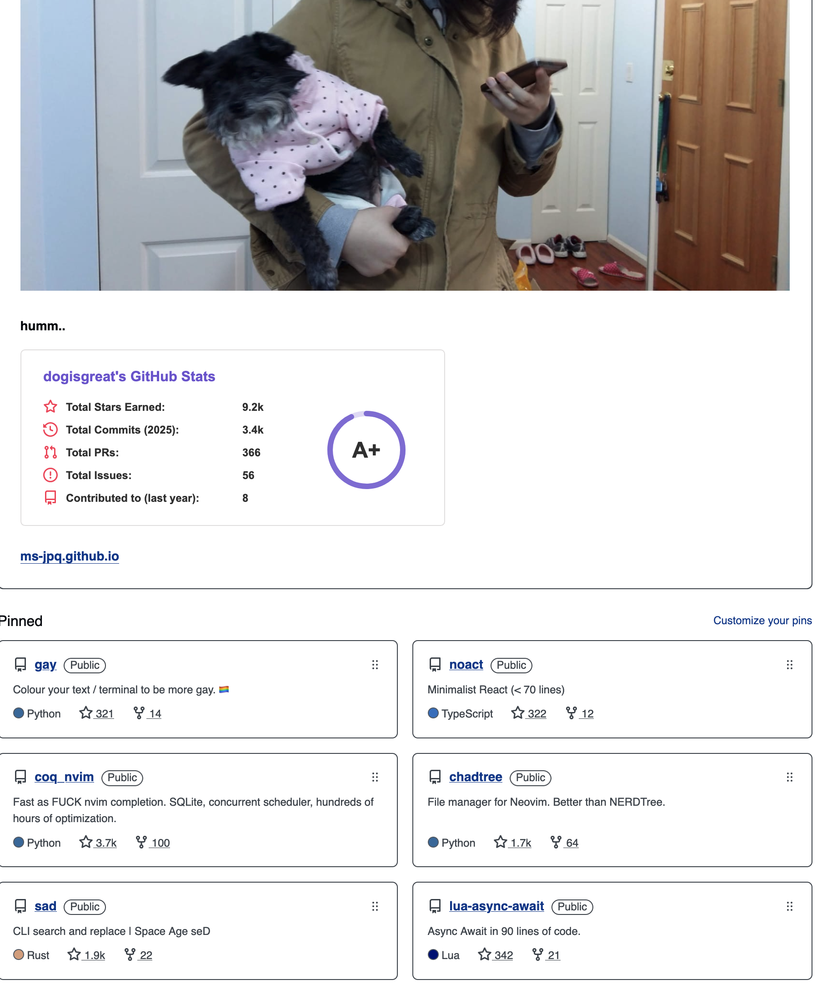
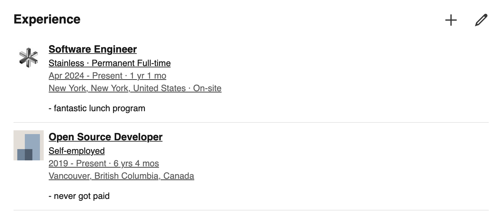
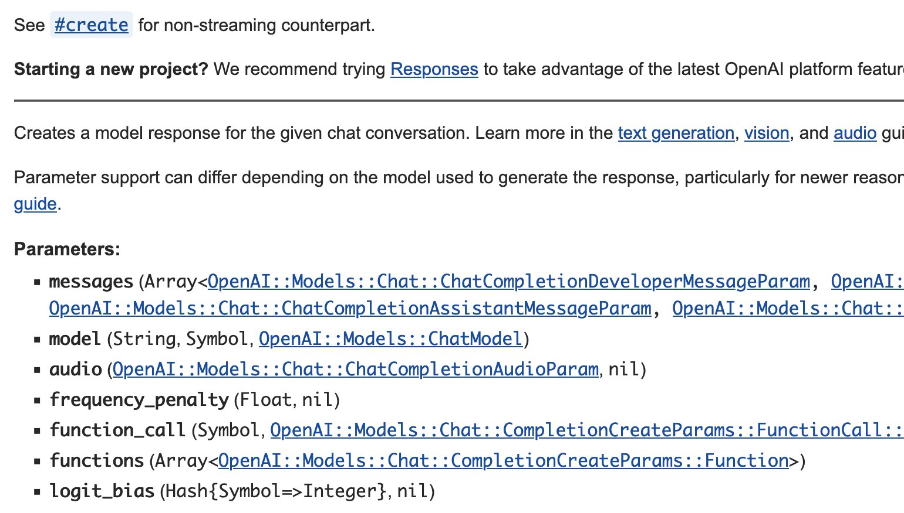
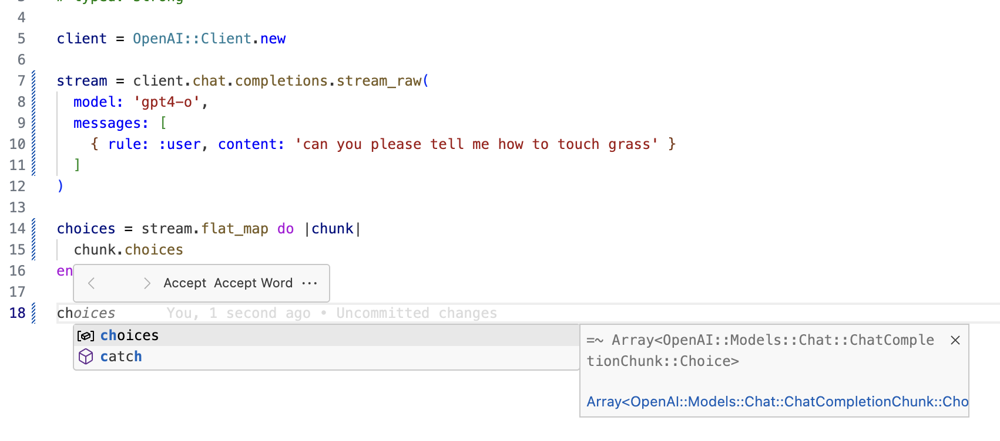
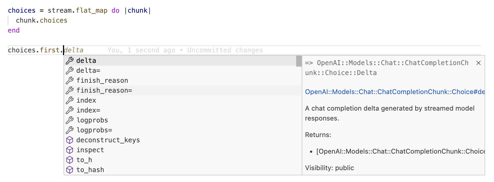
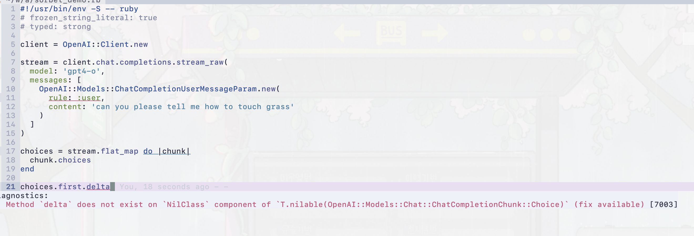
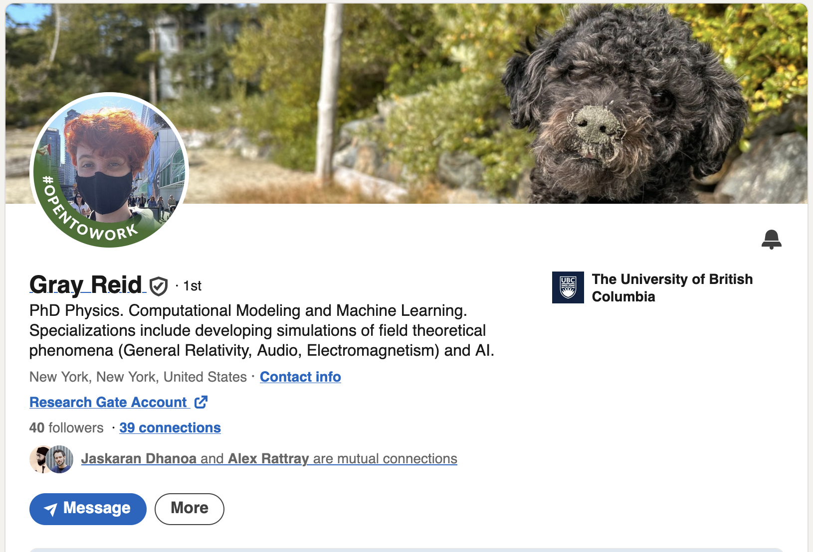

---
theme:
  name: light
---

# Anatomy of A Pretty Good (open) AI SDK

---

- official Ruby SDK coming some times this week

<!-- end_slide -->

# `whoami`

## [github.com/ms-jpq](https://github.com/ms-jpq)



<!-- end_slide -->

## [Stainless API](https://www.stainless.com)

### Laser jet for **OpenAPI** → SDK

- among other things


---

### We have begun shipping Ruby SDKs

- owner of the ruby printer



<!-- end_slide -->

# Why is OpenAI even paying us?

## [Community SDK](https://github.com/alexrudall/ruby-openai)

- they even support streaming!

```ruby
client = OpenAI::Client.new

client.chat(
  parameters: {
    model: "llama3",
    messages: [{ role: "user", content: "Hello!"}],
    temperature: 0.7,
    stream: proc do |chunk, _bytesize|
      print chunk.dig("choices", 0, "delta", "content")
    end
  }
)
```

---

# **Official** [openai/openai-ruby](https://github.com/openai/openai-ruby/tree/next)

- looks pretty much the same

```ruby
# typed: strong

client = OpenAI::Client.new

stream = client.chat.stream_raw(
  model: "gpt-4",
  messages: [{ role: "user", content: "Hello!"}],
  temperature: 0.7,

)

stream.each do |chunk|
  pp chunk.choices
end
```

<!-- end_slide -->

## Come back to these in a bit

- **typed: strong**

```ruby
# typed: strong
```

- **#each**

```ruby
stream.each
```

<!-- end_slide -->

## Thin Wrapper

- OpenAI ↔ HTTP ↔ JSON ↔ SDK ↔ Ruby

- Server ↔ Transport ↔ Data ↔ Decoding / Encoding ↔ **Your Code**

---

- community SDK

```ruby
module OpenAI
  class Client
    include OpenAI::HTTP
    # ...

    def chat(parameters: {})
      json_post(path: "/chat/completions", parameters: parameters)
    end

    def embeddings(parameters: {})
      json_post(path: "/embeddings", parameters: parameters)
    end

    def completions(parameters: {})
      json_post(path: "/completions", parameters: parameters)
    end

    # ...
  end
end
```

<!-- end_slide -->

# Who is our SDK for?

- you

---

- and your machine

<!-- end_slide -->

## → Documentation

- usually yard docs are kinda meh



<!-- end_slide -->

## Editor Tooling 1

- vscode solargraph generics support



<!-- end_slide -->

## Editor Tooling 2

- vscode solargraph generics support



<!-- end_slide -->

## Static Analysis

- **typed: strong**

- mistake 1: "role" → "rule"

- mistake 2: "choices.first.delta" → "choices.first&.delta"



<!-- end_slide -->

# [RBS](https://github.com/ruby/rbs)

- does anybody even use this?

- we just support it because we can

```ruby
module OpenAI
  module Models
    type completion =
      {
        id: String,
        choices: ::Array[OpenAI::Models::CompletionChoice],
        created: Integer,
        model: String,
        object: :text_completion,
      }

    class Completion < OpenAI::Internal::Type::BaseModel
      attr_accessor id: String
      attr_accessor choices: ::Array[OpenAI::Models::CompletionChoice]
      attr_accessor created: Integer
      attr_accessor model: String
      attr_accessor object: :text_completion
      # ...
      def to_hash: -> OpenAI::Models::completion
    end
  end
end
```

<!-- end_slide -->

# Achieving Tooling Support

- every tool chain in Ruby reads nominal types. e.g. **Class**

- once you start writing **Class**es...

## Abstractions

- do nothing, win


- do everything, lose

<!-- end_slide -->

# Abstraction 2

- i speak for every programmer

---

- **my abstractions**


- **other people's abstractions**

<!-- end_slide -->

# Core Abstraction

## Primary Requirements

1. **human** readable DSL for defining data containers

2. **SDK** readable metadata for performing _canonicalization_ during (de)serialization

3. **tooling** readable anchors points for static analysis

---

## Nominalization

- data → Class

```ruby
module OpenAI
  module Models
    # @see OpenAI::Resources::Completions#create
    #
    # @see OpenAI::Resources::Completions#create_streaming
    class Completion < OpenAI::Internal::Type::BaseModel
      # @!attribute id
      #   @return [String]
      required :id, String

      # @!attribute choices
      #   @return [Array<OpenAI::Models::CompletionChoice>]
      required :choices, -> { OpenAI::Internal::Type::ArrayOf[OpenAI::Models::CompletionChoice] }

      # @!attribute created
      #   @return [Integer]
      required :created, Integer

      # @!attribute model
      #   @return [String]
      required :model, String

      # @!attribute object
      #   @return [Symbol, :text_completion]
      required :object, const: :text_completion
    end
  end
end
```

<!-- end_slide -->

# One More Concept

- **unions**

- expresses a set of possible types

```ruby
module Anthropic
  module Models
    module RawMessageStreamEvent
      extend Anthropic::Internal::Type::Union

      discriminator :type

      variant :message_start, -> { Anthropic::Models::RawMessageStartEvent }

      variant :message_delta, -> { Anthropic::Models::RawMessageDeltaEvent }

      variant :message_stop, -> { Anthropic::Models::RawMessageStopEvent }

      variant :content_block_start, -> { Anthropic::Models::RawContentBlockStartEvent }

      variant :content_block_delta, -> { Anthropic::Models::RawContentBlockDeltaEvent }

      variant :content_block_stop, -> { Anthropic::Models::RawContentBlockStopEvent }
    end
  end
end
```

---

- [anthropic-sdk-beta](https://rubygems.org/gems/anthropic-sdk-beta)

- github repo is not public because: "😭, they forgot to give me permission"

<!-- end_slide -->

# De-Nominalize

- Class → data

- deconstruction

```ruby
stream = client.completions.create_streaming(
  model: :"gpt-3.5-turbo-instruct",
  prompt: "1,2,3,",
  max_tokens: 5,
  temperature: 0.0
)

# deconstruct the first `completion` object, and pluck out the first `choice`
stream.first => { choices: [choice] }

# choice here is still a class type
pp choice.text
pp choice.finish_reason
```

---

- recursive consistency

```ruby
# you can also do it recursively
stream.first => { choices: [{ text: , finish_reason: }] }

pp text
pp finish_reason
```

- trade static analysis for thinness

<!-- end_slide -->

## Nominal Pattern Matching

- great for static analysis

---

```ruby
stream =
  anthropic.messages.create_streaming(
    max_tokens: 1024,
    messages: [{role: :user, content: "Say hello there!"}],
    model: :"claude-3-7-sonnet-latest"
  )

event = stream.first

# true
puts(event in Anthropic::Models::RawMessageStreamEvent)

case event
when Anthropic::Models::RawMessageStartEvent
 pp(event.message)
when Anthropic::Models::RawMessageDeltaEvent
 pp(event.delta)
when Anthropic::Models::RawContentBlockStartEvent
 pp(event.content_block)
else
 # ...
end
```

<!-- end_slide -->

## Structural Pattern Matching

- if you get some data from the SDK:

  - they work with: `case ... in` and `case ... when`

  - **Enum**, **Union**, **BaseModel**, **ArrayOf**, **HashOf**, etc.

---

- deconsturct any Class in the SDK

```ruby
case event
in {type: :message_start, message: {content: content}}
 pp(content)
in {type: :message_delta, delta: delta}
 pp(delta)
in {type: :content_block_start, content_block: content_block}
 pp(content_block)
else
 # ...
end
```

<!-- end_slide -->

## Why Not Both

- recursive consistency

```ruby
class OpenAI::Test::Resources::Chat::CompletionsTest < OpenAI::Test::ResourceTest
  def test_create_required_params
    response =
      @openai.chat.completions.create(messages: [{content: "string", role: :developer}], model: :"o3-mini")

    assert_pattern do
      response => OpenAI::Models::Chat::ChatCompletion
    end

    assert_pattern do
      response => {
        id: String,
        choices: ^(OpenAI::Internal::Type::ArrayOf[OpenAI::Models::Chat::ChatCompletion::Choice]),
        created: Integer,
        model: String,
        object: Symbol,
        service_tier: OpenAI::Models::Chat::ChatCompletion::ServiceTier | nil,
        system_fingerprint: String | nil,
        usage: OpenAI::Models::CompletionUsage | nil
      }
    end
  end
end
```

- in fact, most tests are written via recursive pattern matching assertions

<!-- end_slide -->

# Execution Model

---

## Thin Wrapper (Community)

- Server ↔ Transport ↔ Data ↔ Encoding / Decoding ↔ Your Code

## Thic Wrapper (Official)

- Server ↔ Transport ↔ Data ↔ (Decoding **Canonicalization**) ↔ **(De)-Nominalization** ↔ (Encoding **Canonicalization**) ↔ Your Code

---

## Decoding Canonicalization

- (content-type + bytes) → decoding → primitive data → fancy data

- ("JSON" + `...`) → JSON.parse → "1969-12-31" → Date.parse("1969-12-31")

---

## Encoding Canonicalization

- nominal type (Class) → primitive data → (content-type + encode)

- OpenAI::Models::ChatCompletionMessageParam → {role: :user, content: "Hello!"} → JSON.stringify({role: :user, content: "Hello!"})

<!-- end_slide -->

# OK, what about AI

<!-- end_slide -->

# Streaming HTTP Client

- we use standard library "net-http"

---

- the entire HTTP pipeline is a single stream

- does not buffer entire file into memory for either upstream or down stream

```ruby
require "pathname"

file_object = openai.files.create(file: Pathname("input.jsonl"), purpose: "fine-tune")

puts(file_object.id)
```

---

- buffering

```ruby
file = File.read("input.jsonl")
file_object = openai.files.create(file: StringIO.new(file), purpose: "fine-tune")

puts(file_object.id)
```

<!-- end_slide -->

# **#.each**

- "#.each" means that we have implemented [Enumerable](https://rubyapi.org/3.1/o/enumerable) protocol

- all HTTP responses in sdk are Enumerators of strings, and we do successive stream processing

```ruby
stream = client.completions.create_streaming(
  model: :"gpt-3.5-turbo-instruct",
  prompt: "1,2,3,",
  max_tokens: 5,
  temperature: 0.0
)

stream_of_choices =
  stream
  .lazy
  .select do |completion|
    completion.object == :text_completion
  end
  .flat_map do |completion|
    completion.choices
  end


# calling #.each cleans up HTTP connection
stream_of_choices.each do |choice|
  pp(choice)
end
```

---

- note the automatic HTTP connection cleanup

<!-- end_slide -->

# Decode Server Sent Event 1

```ruby
def decode_lines(enum)
  re = /(\r\n|\r|\n)/
  buffer = String.new.b
  cr_seen = nil

  chain_fused(enum) do |y|
    enum.each do |row|
      offset = buffer.bytesize
      buffer << row
      while (match = re.match(buffer, cr_seen&.to_i || offset))
        case [match.captures.first, cr_seen]
        in ["\r", nil]
          cr_seen = match.end(1)
          next
        in ["\r" | "\r\n", Integer]
          y << buffer.slice!(..(cr_seen.pred))
        else
          y << buffer.slice!(..(match.end(1).pred))
        end
        offset = 0
        cr_seen = nil
      end
    end

    y << buffer.slice!(..(cr_seen.pred)) unless cr_seen.nil?
    y << buffer unless buffer.empty?
  end
end
```

<!-- end_slide -->

# Decode Server Sent Event 2

```ruby
def decode_sse(lines)
  # rubocop:disable Metrics/BlockLength
  chain_fused(lines) do |y|
    blank = {event: nil, data: nil, id: nil, retry: nil}
    current = {}

    lines.each do |line|
      case line.sub(/\R$/, "")
      in ""
        next if current.empty?
        y << {**blank, **current}
        current = {}
      in /^:/
        next
      in /^([^:]+):\s?(.*)$/
        field, value = Regexp.last_match.captures
        case field
        in "event"
          current.merge!(event: value)
        in "data"
          (current[:data] ||= String.new.b) << (value << "\n")
        in "id" unless value.include?("\0")
          current.merge!(id: value)
        in "retry" if /^\d+$/ =~ value
          current.merge!(retry: Integer(value))
        else
        end
      else
      end
    end
    # rubocop:enable Metrics/BlockLength

    y << {**blank, **current} unless current.empty?
  end
end
```

<!-- end_slide -->

# Decode Server Sent Event 3

```ruby
private def iterator
  # rubocop:disable Metrics/BlockLength
  @iterator ||= OpenAI::Internal::Util.chain_fused(@stream) do |y|
    consume = false

    @stream.each do |msg|
      next if consume

      case msg
      in { data: String => data } if data.start_with?("[DONE]")
        consume = true
        next
      in { data: String => data }
        case JSON.parse(data, symbolize_names: true)
        in { error: error }
          message =
            case error
            in String
              error
            in { message: String => m }
              m
            else
              "An error occurred during streaming"
            end
          OpenAI::Errors::APIError.for(
            url: @url,
            status: @status,
            body: body,
            request: nil,
            response: @response,
            message: message
          )
        in decoded
          y << OpenAI::Internal::Type::Converter.coerce(@model, decoded)
        end
      else
      end
    end
  end
  # rubocop:enable Metrics/BlockLength
end
```

<!-- end_slide -->

# Enumerator#rewind

- the streaming core is implemented via using a ruby [Fiber](https://rubyapi.org/3.1/o/fiber) to flip the push based iteration from "net-http"

```ruby
# ... writing this up 1 hour before the talk

# sorry! its a state machine here OK
```

---

- into an Enumerator

```ruby
enum = Enumerator.new do |y|
  y << 1
  y << 2
  y << 3
end

# who knew?
enum.rewind
```

---

```ruby
# clean up mechanism
enum.rewind >> prev_enum.rewind >> prev_prev_enum.rewind
```

<!-- end_slide -->

# Fused Enum

- [Stole it from Rust](https://doc.rust-lang.org/std/iter/trait.FusedIterator.html)

```ruby
def fused_enum(enum, external: false, &close)
  fused = false
  iter = Enumerator.new do |y|
    next if fused

    fused = true
    if external
      loop { y << enum.next }
    else
      enum.each(&y)
    end
  ensure
    close&.call
    close = nil
  end

  iter.define_singleton_method(:rewind) do
    fused = true
    self
  end
  iter
end
```

---

```ruby
def close_fused!(enum)
  enum.rewind.each { break }
end
```

<!-- end_slide -->

- EOF

<!-- end_slide -->

# My Roommate for Hire

- [Linkedin](https://www.linkedin.com/in/gray-reid/)

---


